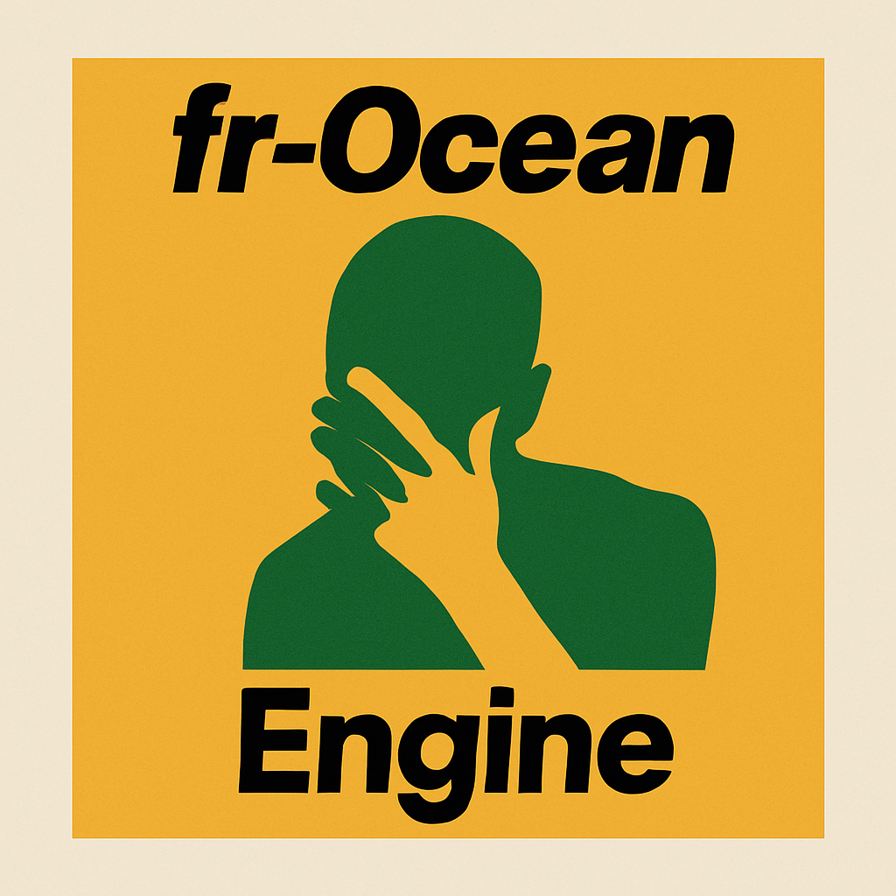

# fr‑ocean engine

A cross‑platform 2D C++ game engine with physics, scripting, and rendering capabilities.

## Overview

This 2D game engine provides an easy‑to‑use framework for creating 2D games with physics simulation, Lua scripting, audio playback, and sprite rendering. Built with modern C++17 and utilizing industry‑standard libraries, it offers a comprehensive feature set while maintaining a simple interface for game developers.

## Features

- **Cross‑Platform Support**: Runs on Windows, macOS, and Linux
- **Modern C++**: Written in C++17
- **Rendering**: SDL2‑based rendering with sprite and text support
- **Physics**: Box2D integration for realistic 2D physics
- **Audio**: Sound effects and music playback via SDL2_mixer
- **Scripting**: Lua integration for game logic and behavior
- **Component System**: Flexible component‑based architecture
- **Asset Management**: Organized resource management for images, audio, and text
- **Configuration**: JSON‑based configuration system

## Requirements

### Windows
- Visual Studio 2019 or newer
- CMake 3.16+

### macOS
- Xcode 12+ or Command Line Tools
- CMake 3.16+

### Linux
- GCC 9+ or Clang 9+
- CMake 3.16+
- SDL2, SDL2_image, SDL2_mixer, SDL2_ttf development packages

## Installation

### Pre‑Built Binaries

1. Download the latest release for your platform from the [Releases](https://github.com/jackgaff/game_engine/releases) page
2. Extract the archive to your desired location
3. Run the included examples to verify installation

### Building from Source

#### Windows

```bash
git clone https://github.com/yourusername/game_engine.git
cd game_engine
mkdir build
cd build
cmake -G "Visual Studio 17 2022" ..
cmake --build . --config Release
cmake --install . --config Release    # optional system‑wide install
cpack                                  # create .zip / .tgz packages
```

#### macOS

```bash
git clone https://github.com/yourusername/game_engine.git
cd game_engine
mkdir build
cd build
cmake ..
cmake --build . --config Release
sudo cmake --install . --config Release   # optional install
sudo cpack                                 # create .tar.gz / .zip packages
```

For Xcode project generation:

```bash
cmake -G Xcode ..
```

#### Linux

```bash
git clone https://github.com/yourusername/game_engine.git
cd game_engine
mkdir build
cd build
cmake ..
make
sudo make install          # optional install
sudo cpack                 # create .tar.gz / .zip packages
```

## Usage

### Using Lua Scripts

1. Create a Lua script for component behavior:

```lua
-- ConstantMovement.lua
ConstantMovement = {
    x_vel = 0,
    y_vel = 0,

    OnStart = function(self)
        self.transform = self.actor:GetComponent("Transform")
    end,

    OnUpdate = function(self)
        self.transform.x = self.transform.x + self.x_vel
        self.transform.y = self.transform.y + self.y_vel
    end
}
```

## Project Structure

```
game_engine/
├── build/              # Build directory (generated)
├── game_engine/        # Engine source code
│   ├── Actor.cpp       # Actor implementation
│   ├── Actor.hpp       # Actor header
│   ├── ...             # Other engine sources
├── resources/          # Example resources
│   ├── audio/          # Audio files
│   ├── component_types/# Lua component scripts
│   ├── fonts/          # Font files
│   ├── images/         # Image files
│   └── scenes/         # Scene definition files
├── vendor/             # Third‑party libraries
│   ├── box2d/          # Box2D physics library
│   ├── glm/            # Math library
│   ├── lua/            # Lua scripting
│   ├── ...             # Other dependencies
├── CMakeLists.txt      # CMake build configuration
└── README.md           # This file
```

## Documentation

Comprehensive documentation for the API can be found in the [project website](https://jackgaff.github.io) directory after building. The documentation covers:

- Custom CMake feature set
- Engine API reference
- Component system usage
- Physics system
- Audio system
- Rendering capabilities
- Scripting interface

## License

This project is licensed under the (not sure yet) License – see the LICENSE file for details.

## Contributing

n / a at the moment

## Credits

This engine utilizes the following open‑source libraries:

- [SDL2](https://www.libsdl.org/) – Simple DirectMedia Layer
- [Box2D](https://box2d.org/) – 2D physics engine
- [Lua](https://www.lua.org/) – Scripting language
- [LuaBridge](https://github.com/vinniefalco/LuaBridge) – C++ ↔ Lua binding
- [GLM](https://github.com/g-truc/glm) – Mathematics library
- [RapidJSON](https://rapidjson.org/) – JSON parser / generator

## Contact

If you have any questions or feedback, please open an issue on GitHub or contact jackgaff@umich.edu directly.

